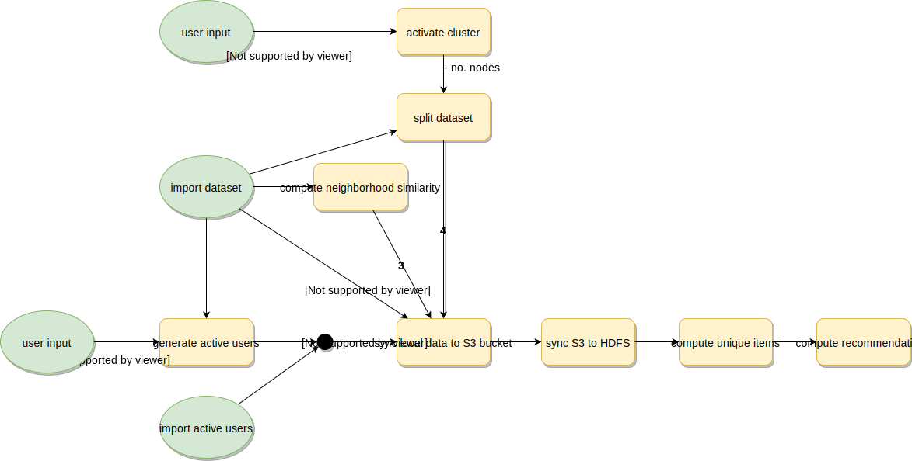

# Interfaz web ad hoc para el manejo del algoritmo de recomendación kNN

## Objetivos del proyecto

1. Manejo autónomo del algoritmo de recomendación sin necesidad de utilizar en ningún momento la consola de AWS.
2. Superar unos mínimos respecto a la calidad visual de la web. Esto se logra por medio del uso del sistema de plantillas de Django y el uso de Bootstrap.
3. No se aborda el despliegue y configuración sobre un entorno de producción con Apache, SSL, MariaDB, etc.
5. No obstante, la aplicación final debe ser fácilmente desplegable siguiendo los pasos del manual de instalación proporcionado.

## Instalación

### Software utilizado
- Ubuntu 18.04
- Python 3.6.7
- Django 2.2
- Bootstrap 4.1.3
- AWS CLI 1.16.148

## Instalación de AWS CLI
Existen varias maneras de instalar las herramientas de consola para AWS, tal como se describe en [la documentación](https://docs.aws.amazon.com/cli/latest/userguide/cli-chap-install.html). En el caso del sistema operativo Ubuntu, la utilidad ```snap``` es una de las maneras más fáciles de obtenerla:

```sudo snap install aws-cli```

Una vez instalada es necesario realizar una primera configuración, que vincula la herramienta con una cuenta de Amazon AWS:

```aws configure```

Se necesita el AWS Access Key ID y una AWS Secret Access Key. Más información en la [documentación oficial](https://docs.aws.amazon.com/cli/latest/userguide/cli-chap-configure.html#cli-quick-configuration).

### Preparación del entorno y descarga del proyecto
1. Instalar ```pip3```: ```sudo apt-get install python3-pip```.
2. Instalar ```virtualenv```: ```pip3 install --user virtualenv```. Esta orden instala la herramienta en ```~/.local/bin```. Puede ser necesario cerrar la sesión y volver a entrar para que esta ruta sea añadida al PATH. Alternativamente se puede actualizar el PATH sin necesidad de cerrar la sesión, usando ```source ~/.profile```.
3. Clonar el repositorio del proyecto desde Github, mediante SSH, ```git clone git@github.com:diegots/fic-tfg-django-web.git```, o bien HTTPS, ```git clone https://github.com/diegots/fic-tfg-django-web.git```.
4. Navegar al directorio del proyecto: ```cd fic-tfg-django-web/```.
5. Crear un nuevo entorno virtual, ```virtualenv env``` y activarlo: ```source env/bin/activate```.
6. Instalar Django 2.2: ```pip3 install 'django==2.2'```.
7. (Opcional) Para comprobar que Django está correctamente instalado se puede ejecutar: ```python -m django --version```, lo cual deberá mostrar el número de versión instalado o un error en caso de que algo haya salido mal.

Bootstrap y sus dependencias ya están incluidos en las rutas ```static/css``` y ```static/js```, por lo cual no es necesario instalarlos. Ahora ya se puede desactivar el entorno virtual: ```deactivate```.

### Configuración
Es necesario configurar varios parámetros para la correcta ejecución de la aplicación. Los ficheros a editar son:
- ```scripts/active-python-env.sh```
    - ```DJANGO_ROOT_DIR``` en la variable  hay que indicar la ruta al directorio del proyecto.
    - ```VIRTUALENV_DIR_NAME``` en la variable  hay que indicar el nombre utilizado para el directorio del entorno virtual.
- ```scripts/global-vars.sh```. En este fichero debe definirse:
    - ```TFG_BUCKET_NAME``` nombre del bucket S3 que se desea utilizar.
    - ```TFG_SECRET_KEY``` clave utilizada por Django para garantizar la seguridad del servicio.
    - ```TFG_SSH_KEY``` nombre de la clave SSH utilizada para iniciar sesión en las máquinas del cluster.
    - (Opcional) ```TFG_ALLOWED_HOSTS``` direcciones IP admitidas por el servidor web de Django.
    - (Opcional) ```TFG_DEBUG``` activa las funciones de depuración del servicio web.

### Creación del bucket
El script ```scripts/create-s3-bucket.sh``` facilita la creación inicial del bucket que se desea utilizar. El nombre del bucket se obtiene de la variable ```$TFG_BUCKET_NAME``` definida previamente. Los comandos a ejecutar son:
1. ```source scripts/active-python-env.sh```
2. ```source scripts/create-s3-bucket.sh```
3. ```deactivate```

### Preparar la base de datos
La creación y configuración de la base de datos se realiza con dos comandos:
1. ```source scripts/active-python-env.sh```
2. ```python manage.py migrate```
3. ```deactivate```

El comando ```migrate``` de la herramienta ```manage.py``` genera la base de datos a partir de las definiciones existentes en ```models.py```.

### Crear un usuario administrador
Para crear un primer usuario llamado _joe_ se utiliza ```manage.py``` (con el entorno virtual activado):
```python manage.py createsuperuser --username=joe --email=joe@example.com```

Se solicitará una contraseña al ejecutar el comando en la consola. Este usuario puede acceder a la aplicación y a la consola de administración de Django en <http://127.0.0.1:8000/admin/>.

Para finalizar el entorno virtual se puede cerrar la consola o bien usar ```deactivate```. Con este paso se finaliza la instalación.

## Inicio normal del servicio
Para iniciar el servicio hechos los pasos anteriorres, basta con ejecutar:
- ```source scripts/active-python-env.sh``` y
- ```python manage.py runserver```
El servidor web escucha en <http://127.0.0.1:8000/>, o en la IP indicada. Se puede detener en cualquier momento con ```Ctrl-c```.

## Descripción del servicio
El siguiente diagrama describe el funcionamiento del servicio. Diagrama elaborado con [Draw.io](http://draw.io):



### Trade offs
1. La similitud entre los vecinos se calcula en la misma máquina donde se ejecuta el servidor web. Dado que este cálculo es especialmente costoso en tiempo de CPU, en un entorno realista sería necesario disponer de una máquina separada. La ventaja de hacer el proceso así es que es más fácil de montar _stand alone_
2. Si bien la obtención de los ítems únicos y el máximo ítem Id dependen únicamente del dataset, se van a calcular con cada _experimento_. Inicialmente vamos a suponer que el tiempo necesario es bajo en comparación con las recomendaciones. En caso de querer reutilizar los datos entre ejecuciones habría que salvar la información a la BD y recuperarla en caso necesario.

